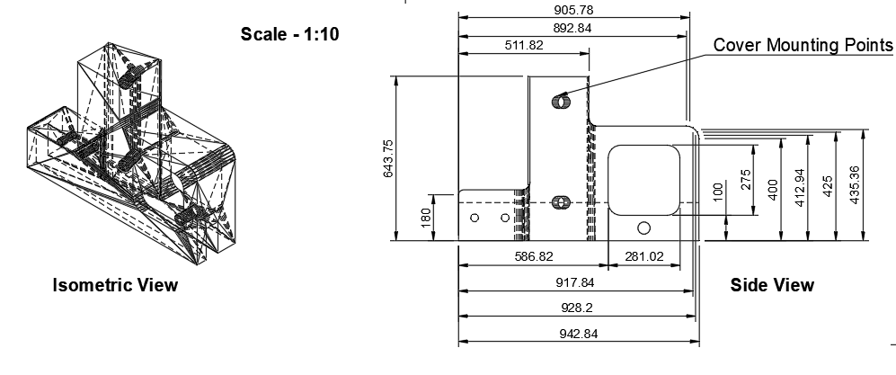

# Acrylic Protective Covers – Medical-Grade Enclosure Design

This repository documents the design and fabrication process for custom acrylic covers developed to protect sensitive internal mechanical and electrical components of a medical device. The covers were engineered to meet cleanliness, manufacturability, and aesthetic constraints while ensuring mechanical durability under user-applied loads.

## 📌 Problem Statement

The device required a **cleanable, protective enclosure** to:
- Prevent user access to internal components.
- Ensure compliance with medical-grade hygiene standards.
- Be cost-effective and easy to manufacture.

Initial concepts involved:
- **3D printed panels**: But they included difficult-to-clean grooves and were impractical at large scales.
- **Vinyl sheets over frames**: These introduced creases that accumulated debris and lacked rigidity.

## ✅ Final Design Choice: Acrylic Covers

We ultimately selected **laser-cut acrylic** due to its:
- Smooth, cleanable surfaces.
- Compatibility with heat bending for 3D shaping.
- Suitability for precise sheet-based fabrication.

Each cover was designed as a **standalone piece** machined from a single acrylic sheet to simplify manufacturing and scalability.

To securely attach these covers to the underlying device chassis, we also developed **custom 3D printed mounting brackets** designed to align with the cover geometry and allow clean integration without visible fasteners.

## 🔧 Design Process

### 1. Design Constraints
- Easy to wipe down and sterilize.
- Visually cohesive and sleek.
- Covers must withstand mechanical forces applied by users.
- Minimize number of bends/cuts for efficient mass manufacturing.
- Seamless mounting with minimal visible hardware.

### 2. CAD and Simulation
- Designed using **Fusion 360’s sheet metal tools** for parametric bend control.
- Conducted **static load and impact simulations** to ensure structural integrity under real-world use.
- Designed **custom 3D printed mounts** to interface with existing device geometry.

### 3. Prototyping and Manufacturing
- Initial prototypes fabricated using:
  - **Laser cutting** for profile creation.
  - **Heat bending** with jigs to form 3D structures.
  - **3D printed jigs** to align and bend acrylic sheets consistently.
  - **3D printed mounting brackets** to securely and cleanly attach covers to device.
- Final versions optimized to **reduce number of bends and cuts** for scale-up manufacturing.

## 🖼️ Images

### 📐 Rendered Covers

| Cover 1 | Cover 2 |
|--------|---------|
|  |  |

### 🧩 Mounting Bracket Drawings

| Full Assembly Drawing | Side Bracket Drawing |
|-----------------------|----------------------|
|  |  |

> 🔧 **Note:** “Cover Mounting Points” and “Cover Mounting Holes” are visible in both technical drawings to highlight integration locations.

## 🛠️ Tools Used

- **Fusion 360** – CAD modeling with sheet metal workflows and mount design.
- **Ultimaker S5** – 3D printed alignment jigs and custom mounting brackets.
- **Epilog Laser Cutter** – For precision cutting.
- **Heat bender** – To form acrylic bends.
- **FEA module in Fusion 360** – For static load and impact simulations.

## 🧪 Key Outcomes

- Fully enclosed sensitive components with a **single-material, easy-to-clean solution**.
- Achieved **aesthetic coherence** while maintaining manufacturability.
- Developed a repeatable fabrication process using common fab lab tools.
- Designed **custom mounting system** for seamless device integration.
- Optimized design for **scaling to small-batch manufacturing**.

